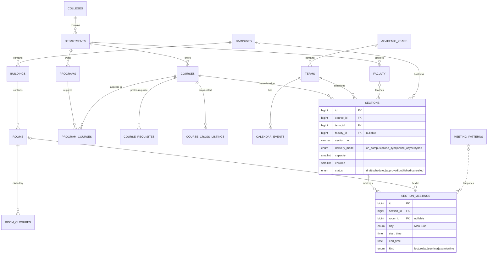
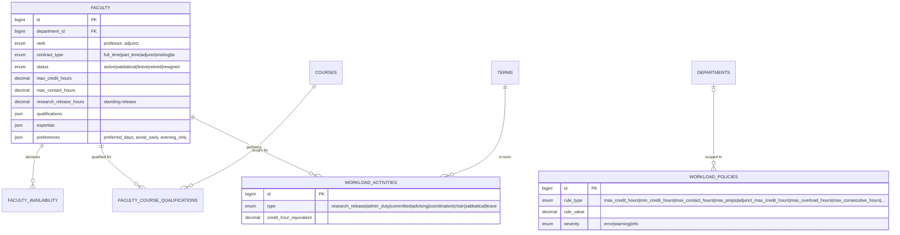
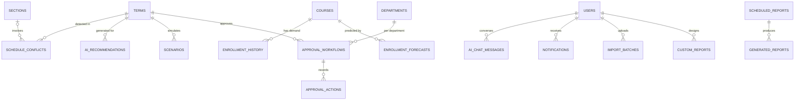
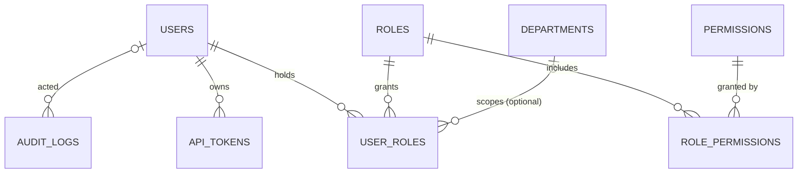

# Entity-Relationship Diagram

Full DDL: [`database/schema.sql`](../database/schema.sql). Render the Mermaid diagrams on GitHub
or any Mermaid viewer.

## Core scheduling domain

## Faculty & workload domain

## AI, demand & operations domain

## Security domain

## Data dictionary (key tables)

| Table | Purpose |
|---|---|
| `terms` | Academic terms (semester/quarter/summer/mini) with workflow status |
| `courses` | Catalog: credit/contact hours, capacity, lab & equipment needs, requisites |
| `sections` | The schedulable unit — course × term × section number |
| `section_meetings` | Individual weekly meetings (a section may have lecture + lab) |
| `faculty` | Profiles: rank, contract, caps, releases, expertise (JSON), preferences (JSON) |
| `faculty_availability` | Weekly availability/preference windows used as hard constraints |
| `faculty_course_qualifications` | Qualification level + teaching history per course (drives AI scoring) |
| `workload_activities` | Non-teaching load with credit-hour equivalents |
| `workload_policies` | Configurable rules engine (institution- or department-scoped) |
| `schedule_conflicts` | Persisted conflict detections with AI suggestions and lifecycle |
| `ai_recommendations` | Actionable machine-applicable recommendations (JSON payload) |
| `enrollment_history` / `enrollment_forecasts` | Demand inputs for the generator |
| `scenarios` | What-if simulations with parameters and results (JSON) |
| `approval_workflows` / `approval_actions` | Approval pipeline state + audit trail |
| `import_batches` | Bulk import validation/commit/rollback bookkeeping |
| `audit_logs` | Immutable record of every state-changing action |
